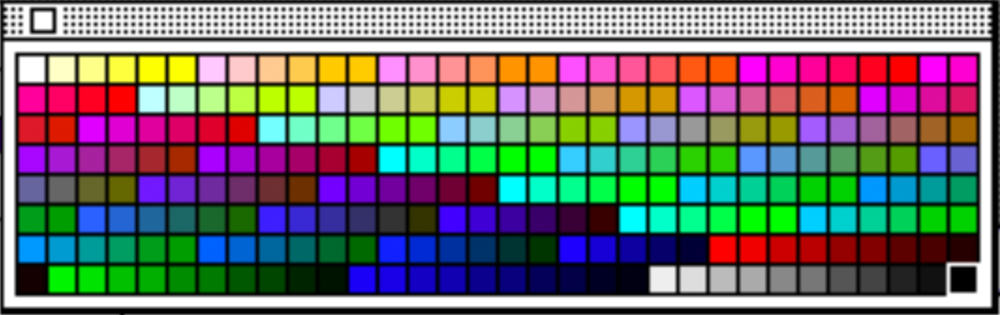
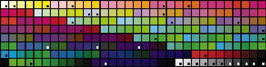
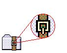

These are some notes and observations I've recorded while working on various hobby projects involving Macintosh icons.

Macintosh icons come in three color depths: 1-bit (black and white), 4-bit (16 colors), and 8-bit (256 colors). The 1-bit color resource also includes a 1-bit mask (opaque or transparent). The 4-bit and 8-bit icons use that 1-bit mask. The standard icon size is 32 pixels by 32 pixels and the small icon size is 16 pixels by 16 pixels.

ResEdit, by default, suggests the 34-color Apple Icon Color Set and you must use the Color menu to select the 256 color palette. (See [Macintosh Human Interface Guidelines](#macintosh-human-interface-guidelines))



To convert icons to modern PNGs, one of the hurdles is converting the Apple 256 color palette to RGB. [Jordan Rose's blog post about Color Palette #8](https://belkadan.com/blog/2018/01/Color-Palette-8/) was helpful. I converted Jordan's `clut8ColorComponents` function to PHP and the resulting RGB values were incorrect -- with some going into the negatives. (I'm putting this down to my PHP conversion and not Jordan's code.)

Using the Digital Color Meter in macOS and the BasiliskII emulator, I can see the pattern in the colors with indices under 215. The palette starts with RGB of 1, 1, 1. The next color is 1, 1, 0.8. After B hits 0, the next color is R 1, G 0.8, B 1. I told this to ChatGPT and it wrote a corrected function to handle that section of the palette.  The updated PHP function is below and a JSON array of the RGB values (multiplied by 255 and then rounded) is available here: [Apple256ColorPalette.json](Apple256ColorPalette.json).

```php
// Originally ported to PHP from https://belkadan.com/blog/2018/01/Color-Palette-8/
// Updated code from ChatGPT.
function clut8ColorComponents($x) {
  if ($x < 215) {
    // This section was produced by ChatGPT.
    $index = $x;
    $step_size = 0.2;
    $R = 1.0;
    $G = 1.0;
    $B = 1.0;

    // Determine how many cycles for R, G, and B
    $full_rgb_cycle = intdiv($index, 36); // Each full R cycle takes 36 steps (6 for G x 6 for B)
    $remainder_after_r = $index % 36;

    // Update R for full RGB cycles
    $R -= $step_size * $full_rgb_cycle;

    // Ensure R doesn't drop below 0
    if ($R < 0) {
        $R = 0;
    }

    // Determine G and B based on remainder after R
    $full_g_cycle = intdiv($remainder_after_r, 6);
    $remainder_after_g = $remainder_after_r % 6;

    // Update G
    $G -= $step_size * $full_g_cycle;

    // Ensure G doesn't drop below 0
    if ($G < 0) {
        $G = 0;
    }

    // Update B
    $B = 1 - ($step_size * $remainder_after_g);

    return [$R, $G, $B];
    // End of replacement section.
  } else if ($x == 255) {
    // Special case: black is last.
    return [0.0, 0.0, 0.0];

  } else {
    // Extra shades of "primary" colors: red, green, blue, and grey.
    $values = [];
    for ($v = 15 ; $v >= 0 ; $v--) {
      if ($v % 3 !== 0) {
        $values[] = doubleval($v) / 15.0;
      }
    }

    if (count($values) != 10) throw new Exception("values must be 10: " . count($values));

    $which = intval(($x - 215) % 10);
    switch (intval(($x - 215) / 10)) {
      case 0: return [$values[$which], 0.0, 0.0];
      case 1: return [0.0, $values[$which], 0.0];
      case 2: return [0.0, 0.0, $values[$which]];
      case 3: return [$values[$which], $values[$which], $values[$which]];
      default: throw new Exception("x must be out of range");
    }
  }
}
```

## Apple Icon Colors

I know this information isn't needed but, for posterity, these are the indices of the Apple Icon Colors in the 256 color palette (in the order presented by ResEdit): 1, 8, 51, 22, 146, 227, 159, 165, 72, 192, 236, 176, 42, 84, 127, 171, 19, 105, 92, 0, 245, 246, 43, 247, 248, 249, 250, 251, 252, 253, 254, 255, 5, 216.

## Macintosh Human Interface Guidelines

The "Macintosh Human Interface Guidelines" Inside Macintosh book say this about icons:

> ### Icon Colors
> This section describes the colors and color techniques that you should use when you design your color icons.
>
> #### The Apple Icon Color Set
> 
> Figure 8-23 shows a palette of the standard 256 colors with a mark on each of the 34 colors used for icon design in system software. If you use ResEdit version 2.1 or later to design and create your icons, the Finder icon family editor provides easy access to these colors. Choose Apple Icon Colors from the Color menu. This command sets the palette in the editor (which is similar to the palette in most graphics applications) to contain the 34 colors used for Finder icons. See ResEdit Reference for information on using ResEdit.
>
> **Figure 8-23 Standard 256-color palette with icon colors marked**
>
> 
>
> This entire set of 34 colors was chosen to be subtle. Subdued colors avoid a "circus" effect on the screen. If you use too many of the same types of colors, people can't discern what is important as easily. Ramps of color based on the initial colors chosen were created to provide shading and blending capabilities. Some light colors were included in the set to be used for large areas. The colors from the Apple logo were included because those colors have a strong Apple identification. The Apple logo colors are very bright and should be used sparingly. The total set of colors provides maximum flexibility in design. You can combine these colors in a dithered pattern to provide additional color effects. Figure 8-24 shows an example of creating a dithered color to use in your icons.
>
> **Figure 8-24 An example of dithered color in an icon**
>
> 
>
> The icon colors were chosen for icon design in system software. It was necessary to limit the number of colors in the set to create consistency across all Apple icons. There are at least 120 system icons. If any number of the 256 system palette colors were used in each icon, the total effect would be a disparate appearance rather than a coherent look to all system icons. Using only 34 colors makes the system icons look like they belong together. In a design scheme that is so large, fewer colors look better.

[Source](https://preterhuman.net/macstuff/techpubs/mac/HIGuidelines/HIGuidelines-172.html)
